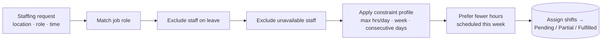
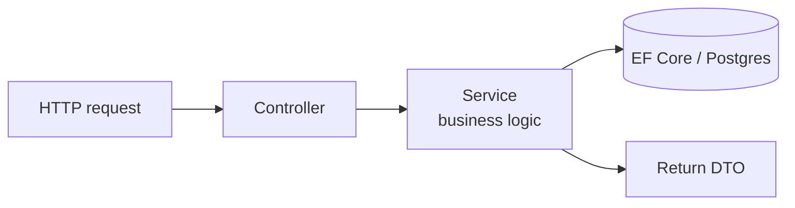
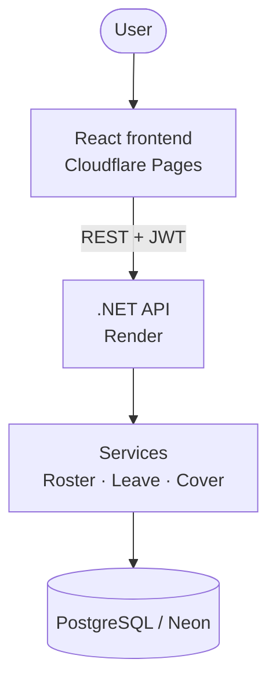

# Airport Admin

**Staff scheduling for airport ground operations.** Raise staffing requests for a terminal, and the system generates a roster that fills them with eligible staff — respecting job roles, leave, availability, and each employee's working-hour limits.

### 🔗 [Try the live demo →](https://airport-admin.pages.dev)

> **Note:** the demo backend spins down when it's not being used (that's how the free tier keeps costs at zero), so your **very first request may take ~10 seconds** while it spins back up. After that, it's quick.

**Demo login** — `admin@airportadmin.com` / `Admin123!` (Admin role, so you see everything).

|                                                   |                                                                                |
| ------------------------------------------------- | ------------------------------------------------------------------------------ |
|  |  |
| _Admin dashboard_                                 | _A staffing request with its generated roster_                                 |

---

## What is this?

Airport ground operations are a scheduling puzzle: multiple locations, multiple job roles, staffing needs that change day to day, and a roster that has to respect leave, availability, and working-hour limits. Airport Admin models that end to end. You:

1. **Raise a staffing request** — e.g. _"Terminal-1 needs 5 Security staff on 13 Jun, 14:22–19:22."_
2. **Generate a roster** — the system fills each request with eligible staff, matching job roles and working around leave, availability, and per-employee constraints.
3. **Everyone sees their view** — admins manage the whole org; crew and supervisors get a self-service "My …" view scoped to their own records.

It's the same kind of workforce-management system used to staff shifts in operations-heavy businesses — built from scratch to show how the scheduling and constraint logic actually works.

**Why it matters:** the hard part isn't storing shifts — it's generating a roster that satisfies real constraints (role matching, leave, availability, max hours/day, max hours/week, max consecutive days) while spreading the load fairly. That logic is the heart of this app.

### Try it in 60 seconds

1. Open the [live demo](https://airport-admin.pages.dev) and sign in with the demo admin account above.
2. Create a **staffing request** for a location, job role, and time window.
3. Hit **Generate roster** and watch it fill the request with eligible staff.
4. Switch to a **"My Roster"** view to see how it looks from a crew member's side.

---

## What it does (features)

- 🧩 **Staffing requests** — raised per location / job role / time window, tracked as Pending, Partially Filled, or Fulfilled.
- 🗓 **Roster generation** — job-role matching, leave-aware, availability-aware; respects per-employee constraint profiles (max hours/day, max hours/week, max consecutive days) and prefers staff with fewer hours already scheduled that week.
- 🏖 **Leave & shift cover** — request/approval workflows for both.
- 🚫 **Availability** — staff can mark themselves unavailable on specific dates.
- 🔐 **Role-based access** — Admin / Supervisor / Crew, with separate self-service "My X" views and org-wide "Admin X" management views.

---

## How it works

The roster generator is the core. Given a staffing request, it walks the pool of staff and keeps only those who fit:



A request flows through a straightforward layered backend:



The split between `Admin*` and `My*` controllers/pages mirrors the actual permission boundary: admins manage org-wide data, while staff and supervisors get a self-service view scoped to their own records.

---

## Tech stack

| Area                 | Technology                                                                                           |
| -------------------- | ---------------------------------------------------------------------------------------------------- |
| **Backend**          | .NET 9, ASP.NET Core Web API, layered Controllers → Services → DbContext                             |
| **Data**             | EF Core 9 (Npgsql), PostgreSQL, code-first migrations                                                |
| **Auth**             | JWT Bearer tokens, BCrypt password hashing, role-based authorization                                 |
| **Scheduling logic** | `RosterService` + `RosterHelper` constraint engine (role, leave, availability, working-hour limits)  |
| **Frontend**         | React 19, TypeScript, Vite, Tailwind CSS, Radix UI / shadcn/ui, React Router, React Hook Form, Axios |
| **API**              | OpenAPI + interactive docs via Scalar                                                                |
| **Cloud**            | Render (API, Docker), Cloudflare Pages (frontend), Neon (PostgreSQL)                                 |

---

## Architecture



The backend is organised as **Controllers → Services → DbContext**:

- **Controllers** — API endpoints, split into `Admin*`, `My*`, and shared resources.
- **Services** — business logic (`RosterService`, `LeaveService`, etc.).
- **Entities / DTOs** — EF Core entities and the request/response contracts exposed over the API.
- **Helpers** — JWT helper and the roster constraint logic.

---

## Engineering highlights

A few things worth calling out for a technical review:

- **Constraint-based roster generation** — the generator isn't a naive fill; it filters by job role, leave, and availability, then enforces per-employee constraint profiles (max hours/day, week, and consecutive days) and balances load by preferring less-scheduled staff.
- **Permission boundary in the shape of the code** — the `Admin*` vs `My*` split isn't just UI; it's the actual authorization boundary, so self-service endpoints can only ever touch the caller's own records.
- **Testable core logic** — the roster constraint logic (`RosterHelper`) is isolated and covered by xUnit tests, so scheduling rules can change without fear.
- **Role-based access** — Admin / Supervisor / Crew roles gate both routes and views, with admin routes requiring the `Admin` role.
- **Clean auth** — JWT bearer tokens with BCrypt-hashed passwords; everything except `/api/auth/*` requires a token.

---

## Running locally

**Prerequisites:** .NET 9 SDK, Node 20+, PostgreSQL.

```bash
# 1. Configure backend secrets
cp AirportAdmin.API/.env.example AirportAdmin.API/.env   # fill in the values

# 2. Apply migrations and run the backend
cd AirportAdmin.API
dotnet ef database update
dotnet run                        # API on http://localhost:5196, docs at /scalar

# 3. Run the frontend
cd frontend
cp .env.example .env
npm install
npm run dev                       # http://localhost:5173
```

Set `VITE_API_URL` in `frontend/.env` if you're pointing at a different API.

**Environment variables:**

| Variable                  | Description                 |
| ------------------------- | --------------------------- |
| `DB_CONNECTION`           | Postgres connection string  |
| `JWT_SECRET`              | JWT signing key             |
| `JWT_EXPIRY_HOURS`        | JWT token lifetime          |
| `VITE_API_URL` (frontend) | Base URL of the backend API |

**Run the tests:**

```bash
dotnet test
```

The roster constraint logic (`RosterHelper`) is covered by unit tests in `AirportAdmin.API.Tests`.

---

## Deployment

- **Backend** — deployed to [Render](https://render.com) as a Docker web service.
- **Frontend** — deployed to [Cloudflare Pages](https://pages.cloudflare.com), built from `frontend/` (`npm run build` → `dist`).
- **Database** — [Neon](https://neon.tech) serverless Postgres.

To keep costs near zero, the demo uses free tiers that scale to zero when idle — hence the ~10 second wake-up on the first request after a quiet period.

---

## Project structure

```
AirportAdmin.API/
├── Controllers/       # API endpoints — Admin*, My*, and shared resources
├── Services/          # Business logic (RosterService, LeaveService, etc.)
├── Entities/          # EF Core entities
├── DTOs/              # Request/response contracts
├── Data/              # AppDbContext, migrations
├── Helpers/           # JWT helper, roster constraint logic
└── Middleware/
AirportAdmin.API.Tests/ # xUnit tests for roster constraint logic
frontend/               # React + TypeScript app
docs/                   # Screenshots, architecture diagram
```

---

## What's next

- Drag-and-drop manual roster editing
- Notifications for leave / cover approvals
- More test coverage — services and controllers, not just the roster helper
- Pagination / filtering on list endpoints
- An audit log for admin actions

## License

MIT

---

_Built as a portfolio project to demonstrate constraint-based scheduling, role-based access control, and a layered .NET API on cloud-native infrastructure._
