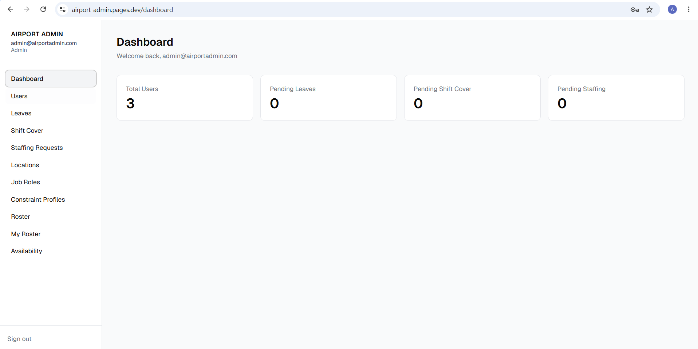
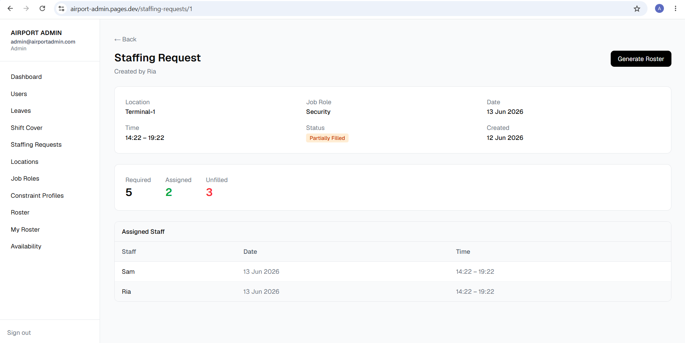
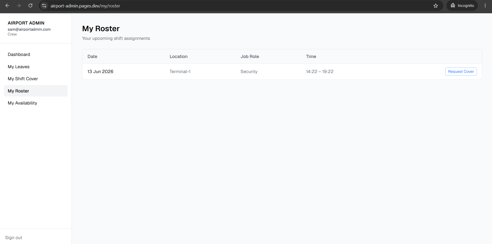
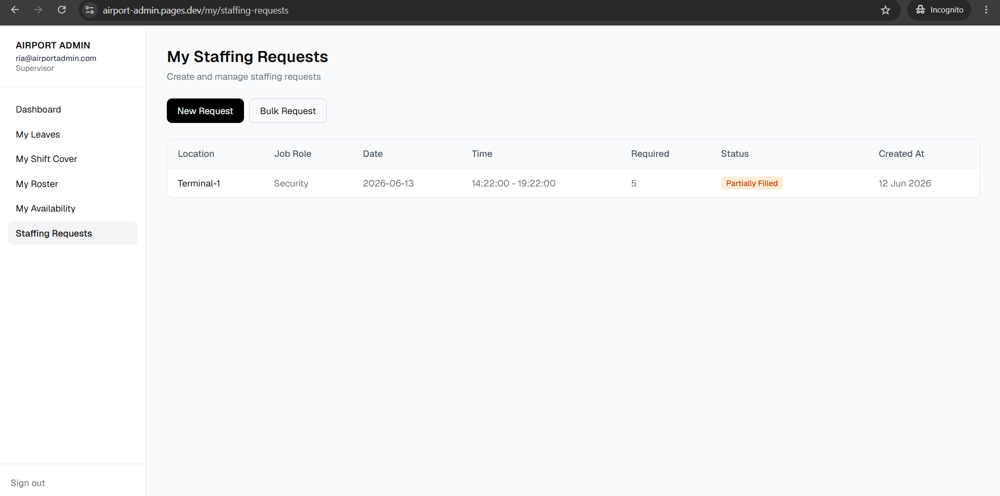
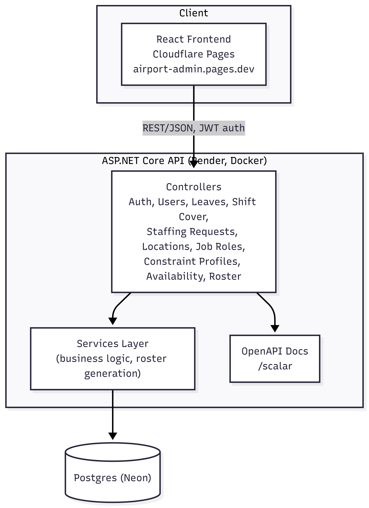

<p align="center">
  
</p>

<h1 align="center">Airport Admin</h1>

<p align="center">
  A staff scheduling and workforce management system for airport ground operations.
</p>

<p align="center">
  <a href="https://airport-admin.pages.dev"><strong>🔗 Live Demo</strong></a> ·
  <a href="https://airport-admin.onrender.com/scalar">API Docs</a>
</p>

<p align="center">
  <em>Note: the backend is hosted on Render's free tier and may take 20-30s to wake up on first request.</em>
</p>

---

## Overview

Airport Admin is built around how airport ground operations actually work — multiple locations, multiple job roles, staffing requirements that change day to day, and a roster that needs to respect leave, availability, and working-hour limits.

Admins (or supervisors) raise **staffing requests** — e.g. "Terminal-1 needs 5 Security staff on 13 Jun, 14:22–19:22" — and the system generates a roster that fills those requests with eligible staff, taking job role matching, leave, availability, and per-employee constraint profiles into account.

### Try it out

```
Email:    admin@airportadmin.com
Password: Admin123!
```

This account has the Admin role, so you can see the full picture — managing users, locations, job roles, staffing requests, leave/cover approvals, and generating rosters.

---

## Features

- **Staffing Requests** — raised per location/job role/time window, tracked as Pending, Partially Filled, or Fulfilled
- **Roster Generation** — job-role matching, leave-aware, availability-aware, respects per-employee constraint profiles (max hours/day, max hours/week, max consecutive days), and prefers staff with fewer hours scheduled that week
- **Leave & Shift Cover** — request/approval workflows for both
- **Availability** — staff can mark themselves unavailable on specific dates
- **Role-based access** — Admin / Supervisor / Crew, with separate "My X" self-service views vs "Admin X" management views

---

## Screenshots

| Dashboard                                          | Generated Roster                                                               |
| --------------------------------------------------- | --------------------------------------------------------------------------------- |
|  |  |

| My Roster                                                    | My Staffing Requests                                                             |
| --------------------------------------------------------------- | ------------------------------------------------------------------------------------ |
|  |  |

---

## Tech Stack

**Backend** — .NET 9, ASP.NET Core Web API, EF Core 9 (Npgsql), JWT Bearer auth, BCrypt, layered Controllers → Services → DbContext, OpenAPI + Scalar

**Frontend** — React 19 + TypeScript + Vite, Tailwind + Radix UI / shadcn/ui, React Router, React Hook Form, Axios

**Infrastructure** — Neon (Postgres), Render (backend, Docker), Cloudflare Pages (frontend)

---

## Architecture

```
AirportAdmin.API/
├── Controllers/       # API endpoints — Admin*, My*, and shared resources
├── Services/          # Business logic (RosterService, LeaveService, etc.)
├── Entities/          # EF Core entities
├── DTOs/              # Request/response contracts
├── Data/              # AppDbContext, migrations
├── Helpers/           # JWT helper, roster constraint logic
└── Middleware/

AirportAdmin.API.Tests/ # xUnit tests for roster constraint logic

frontend/
└── src/
    ├── pages/         # Route-level pages (admin/, my/, auth)
    ├── components/    # Shared UI components, layout
    ├── hooks/         # useAuth, useFetch
    └── lib/           # API client, formatting helpers
```

The split between `Admin*` and `My*` controllers/pages mirrors the actual permission boundary in the app — admins manage org-wide data, while staff and supervisors have a self-service view scoped to their own records.



---

## Getting Started (Local Development)

### Prerequisites

- [.NET 9 SDK](https://dotnet.microsoft.com/download)
- [Node.js 20+](https://nodejs.org/) and npm
- [PostgreSQL](https://www.postgresql.org/)

### 1. Configure backend secrets

```bash
cp AirportAdmin.API/.env.example AirportAdmin.API/.env
```

Fill in the values — see [Environment Variables](#environment-variables) below.

### 2. Apply database migrations and run the backend

```bash
cd AirportAdmin.API
dotnet ef database update
dotnet run
```

API available at `http://localhost:5196`, with interactive docs at `/scalar`.

### 3. Run the frontend

```bash
cd frontend
cp .env.example .env
npm install
npm run dev
```

Frontend available at `http://localhost:5173`. Set `VITE_API_URL` in `.env` if pointing at a different API.

---

## Environment Variables

| Variable                  | Description                 |
| ------------------------- | --------------------------- |
| `DB_CONNECTION`           | Postgres connection string  |
| `JWT_SECRET`              | JWT signing key             |
| `JWT_EXPIRY_HOURS`        | JWT token lifetime          |
| `VITE_API_URL` (frontend) | Base URL of the backend API |

---

## API Overview

| Area                          | Routes                                                                                              | Description                       |
| ----------------------------- | ----------------------------------------------------------------------------------------------------- | ---------------------------------- |
| Auth                          | `POST /api/auth/register`, `POST /api/auth/login`                                                   | Account creation and JWT login    |
| Users (admin)                 | `/api/admin/users`                                                                                  | CRUD for staff accounts           |
| Locations / Job Roles (admin) | `/api/admin/locations`, `/api/admin/job-roles`                                                      | Reference data management         |
| Constraint Profiles (admin)   | `/api/admin/constraint-profiles`                                                                    | Define scheduling rule sets       |
| Staffing Requests (admin)     | `/api/admin/staffing-requests`                                                                      | View/manage required coverage     |
| Staffing Requests (self)      | `/api/my/staffing-requests`                                                                         | Create requests, bulk create      |
| Staffing Request Detail       | `/api/staffing-requests/{id}`                                                                       | Detail view shared by admin/staff |
| Leave (admin)                 | `/api/admin/leaves`                                                                                 | Approve/reject leave requests     |
| Leave (self)                  | `/api/my/leaves`                                                                                    | Apply for / view / cancel leave   |
| Shift Cover (admin)           | `/api/admin/shift-cover`                                                                            | Approve/reject cover requests     |
| Shift Cover (self)            | `/api/my/shift-cover`                                                                               | Apply for / view / cancel cover   |
| Availability (admin)          | `/api/admin/availability`                                                                           | View staff availability           |
| Availability (self)           | `/api/my/availability`                                                                              | Mark unavailable dates            |
| Roster (admin)                | `/api/admin/roster`, `/api/admin/roster/generate`, `/api/admin/roster/generate/{staffingRequestId}` | Generate and manage rosters       |
| Roster (self)                 | `/api/my/roster`                                                                                    | View own assigned shifts          |

Everything except `/api/auth/*` requires a JWT bearer token, and admin routes require the `Admin` role.

---

## Deployment

- **Backend** — deployed to [Render](https://render.com) as a Docker web service
- **Frontend** — deployed to [Cloudflare Pages](https://pages.cloudflare.com), built from `frontend/` (`npm run build` → `dist`)
- **Database** — [Neon](https://neon.tech) serverless Postgres

---

## Testing

```bash
dotnet test
```

The roster constraint logic (`RosterHelper`) is covered by unit tests in `AirportAdmin.API.Tests`.

---

## What's Next

- Drag-and-drop manual roster editing
- Notifications for leave/cover approvals
- More test coverage — services and controllers, not just the roster helper
- Pagination/filtering on list endpoints
- An audit log for admin actions

## License

MIT
